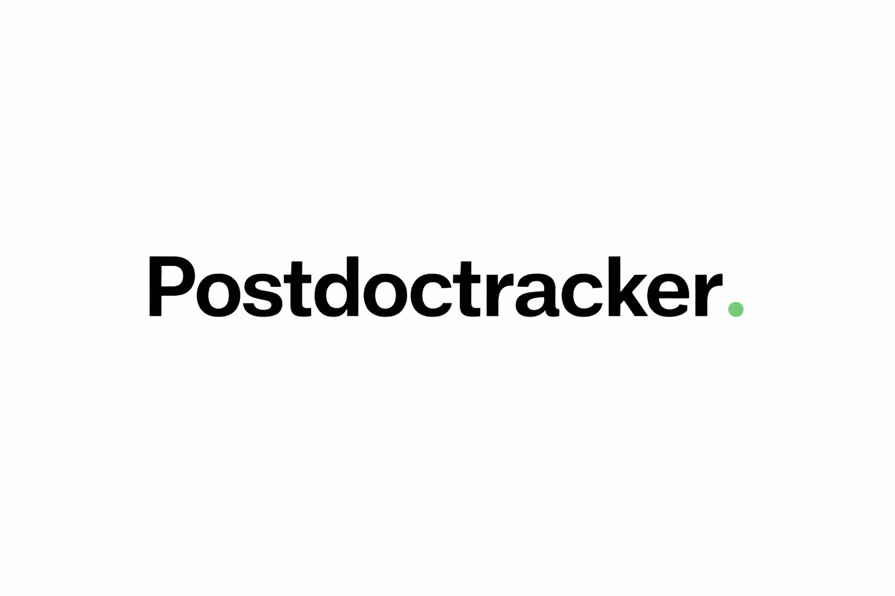

# Postdoc Tracker

A local web app to track postdoc and PhD job offers. Fetch jobs from academic and industry sources, scrape individual pages by URL, or add positions manually. Annotate with notes, rate by affinity, and mark applications.

Data is stored locally in `~/.postdoc-tracker/data/jobs.json`: nothing leaves your machine.

## Install

```bash
pip install git+https://github.com/eloicampagne/postdoc-tracker
```

Or clone and install in editable mode for development:

```bash
git clone https://github.com/eloicampagne/postdoc-tracker
pip install -e postdoc-tracker
```

## Run

```bash
postdoc-tracker
# or
python -m postdoc_tracker
```

Opens `http://localhost:3742` in your browser. Stop with `Ctrl+C`.

### Options

```
--port PORT      Port to listen on (default: 3742)
--no-browser     Start the server without opening the browser
--http           Force HTTP even if SSL certificates are present
```

## Electron desktop app

Requires [Node.js](https://nodejs.org) (recommended: install via [nvm](https://github.com/nvm-sh/nvm)).

```bash
cd electron
npm install
npm start
```

This opens the app in a standalone window instead of the browser.

## Features

- Fetch jobs from INRIA, CNRS, LinkedIn, Welcome to the Jungle, or any RSS feed URL
- Scrape any job page by URL (extracts title, institution, deadline, description)
- Add jobs manually
- Auto-tagging by domain, keywords are fully configurable in `~/.postdoc-tracker/config.yaml`
- Filter by domain, position type (postdoc / PhD / other), and location
- Sort by deadline, affinity, or date added
- Star rating (1-5) and notes per job, saved automatically
- Bulk delete selected jobs
- Theming: colors, font, and accent fully configurable in `~/.postdoc-tracker/config.yaml`

## Configuration

On first run, a default `config.yaml` is created at `~/.postdoc-tracker/config.yaml`. When running from source, a `config.yaml` in the project root takes priority.

| Section | What it controls |
|---|---|
| `app` | Port and window title |
| `search` | Default keywords/location pre-filled in the UI |
| `filter_out` | Keywords that silently drop a fetched job (e.g. internship) |
| `domain_rules` | Domain tags and their trigger keywords; add/rename/remove freely |
| `style` | Font, accent color, background, etc. |

Restart the server after editing `~/.postdoc-tracker/config.yaml`.

### Adding a domain

```yaml
domain_rules:
  robotics:
    - robotics
    - robot learning
    - manipulation
    - autonomous systems
```

The sidebar filter button and domain checkboxes in forms are generated automatically.

## HTTPS (optional, needed for Safari on macOS)

Generate a self-signed certificate and place it in `~/.postdoc-tracker/`:

```bash
openssl req -x509 -newkey rsa:2048 -keyout ~/.postdoc-tracker/cert.key \
  -out ~/.postdoc-tracker/cert.crt -days 3650 -nodes \
  -subj "/CN=localhost" -addext "subjectAltName=IP:127.0.0.1,DNS:localhost"
```

The server auto-detects the certificates and switches to HTTPS. On first visit, click through the self-signed certificate warning.

## Sources

| Source | Notes |
|---|---|
| INRIA | Filters by keyword and location post-scrape |
| CNRS | Filters by keyword post-scrape |
| LinkedIn | Location-aware; uses `en-US` locale to avoid regional index bias |
| Welcome to the Jungle | Queries Algolia directly; supports city and country filtering |

To add or remove sources, edit `postdoc_tracker/sources.py`.

## Stopping the server

Press `Ctrl+C`. If you lost the terminal:

```bash
lsof -i :3742
kill <PID>
```
